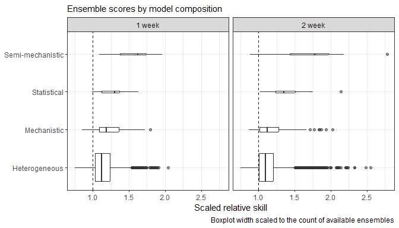
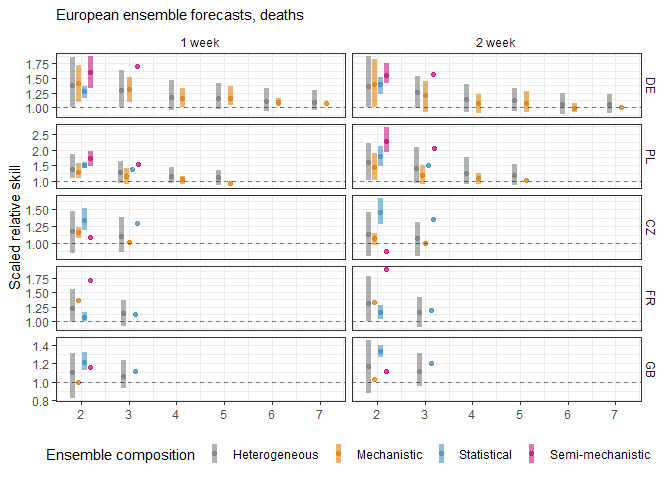

Ensemble model diversity
================

### Identifying model types within varying ensemble compositions

#### Aim

- Comparing performance of ensembles by the methodology of component
  models
- Specifically comparing ensembles that combine across heterogeneous
  model types (among mechanistic, semi-mechanistic, or statistical), or
  whether the ensemble is of a single homogeneous model type

#### Methods

- 39 Euro Hub models forecasting deaths, classified by 3 coders
- All available ensemble recombinations for 5 countries
- Ensemble method is the median
- Performance metric is scaled relative skill against Hub median
  ensemble

#### Results

##### Available models

Unique models used in ensemble combinations, by method classification
and target:

| classification   |  DE |  PL |  CZ |  FR |  GB |
|:-----------------|----:|----:|----:|----:|----:|
| Mechanistic      |   7 |   5 |   3 |   2 |   2 |
| Semi-mechanistic |   3 |   3 |   2 |   2 |   2 |
| Statistical      |   3 |   3 |   3 |   3 |   3 |

##### Ensemble scores by model classification

Distribution of all ensemble scores by model classification, across all
(five) location targets:

<!-- -->

##### Ensemble scores by number of components

Plotting the mean and 90% range of performance of ensembles with
increasing numbers of models, in comparison to the Hub ensemble (1).

- Plotting homogeneous ensembles by their individual model type:

<!-- -->

- Plotting all homogeneous ensembles against all heterogeneous
  ensembles:

<!-- -->

<!-- -->
